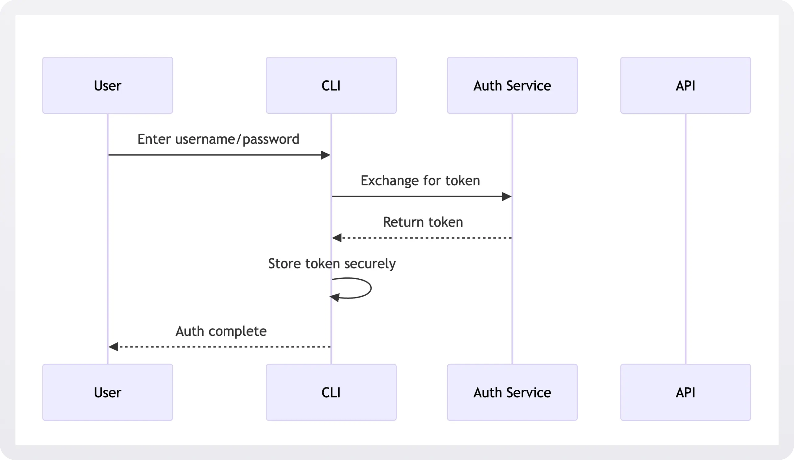
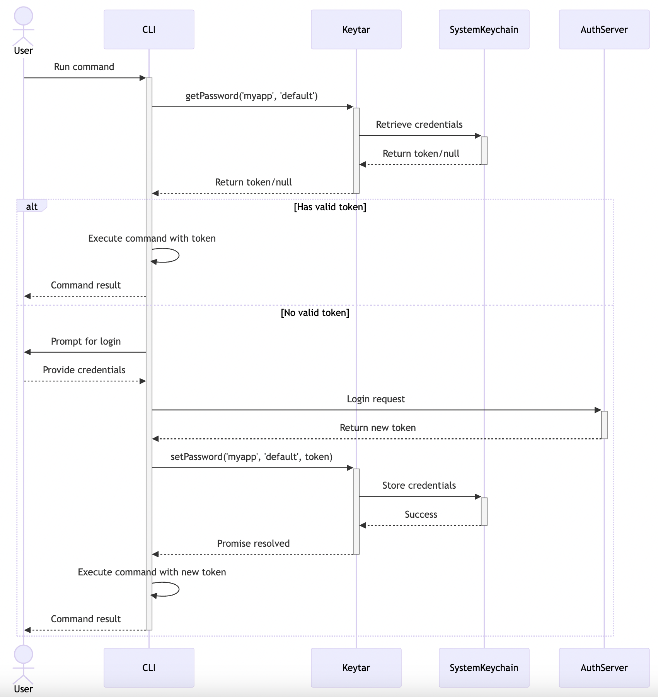

# Password Manager GophKeeper

GophKeeper is a client-server system that allows the user to securely and safely store logins, passwords, binary data and other private information.

# User authentication flow

User registration and auth is performed using a simple username and password.

# Token storage 

Once the user is authenticated, the server returns a token that the client stores in a secure location.

